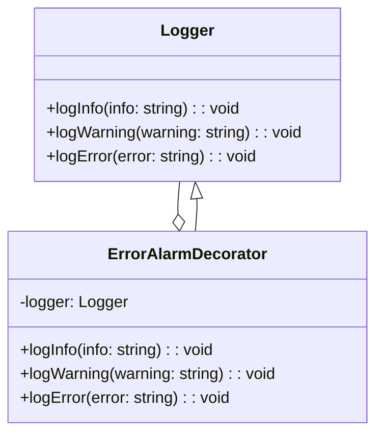
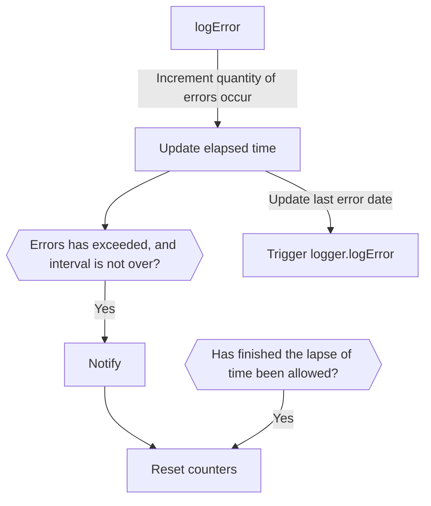

This exercise aims to implement a mechanism that notifies when occurring so many errors in a lapse of time.

We assume the logger implemented currently is provided by a provider.

Eg:

```ts
class MyService {
  private logger = LoggerProvider.getLogger();

  public async createUser(user: User): void {
    try {
      await UserModel.create(user);
      this.logger.logInfo('User created successfully.', user);
    } catch (e) {
      this.logger.logError('Something went wrong while creating the user.', user);
    }
  }
}
```

This way, we could determine which logger to use without impacting our application.
We intend to decorate our Logger to add the alarm control without altering it.



Eg:

```ts
class LoggerProvider {
  static getLogger(): Logger {
    // This is the logger we want to use. It could be the same as we had.
    const selectedLogger = new LocalLogger();
    return new ErrorAlarmDecorator(selectedLogger, {
      maxErrors,
      maxTime,
      notification,
    })
  }
}
```

The logic to implement the error alarm must consider different aspects:
1) We must know how many times `logError` has been called in a lapse of time.
2) Notify when it has exceeded the maximum errors allowed, and the interval is not over.
3) Clear the interval either when finishing the lapse of time allowed or when notifying.


