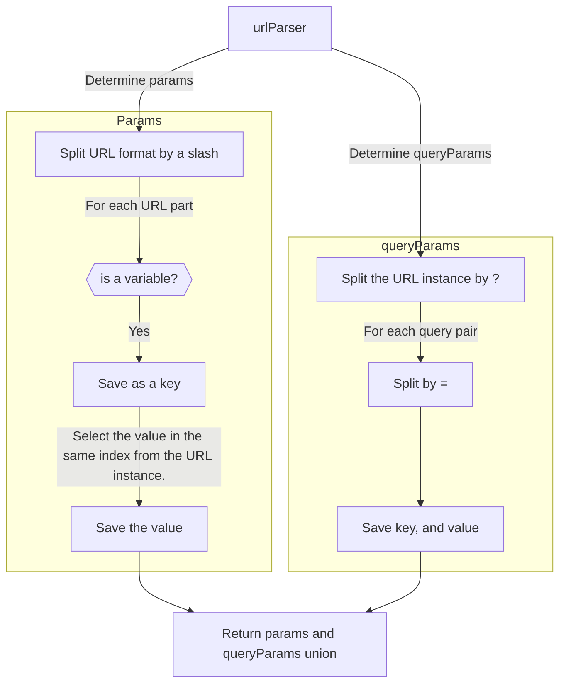

This exercise aims to implement a URL parser that contains a hash(key, value) given a URL format string and a URL instance.

The logic to implement the parser must consider different aspects:

1) The URL format considers the part that begins with a colon as a variable.
2) The URL instance has the same URL format given.
3) The URL instance may also contain URL parameters.

