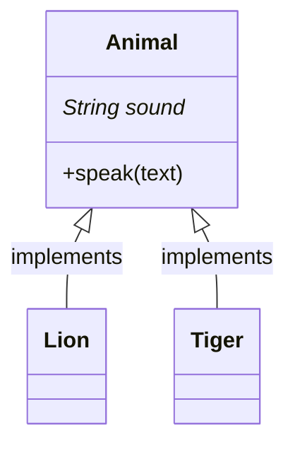
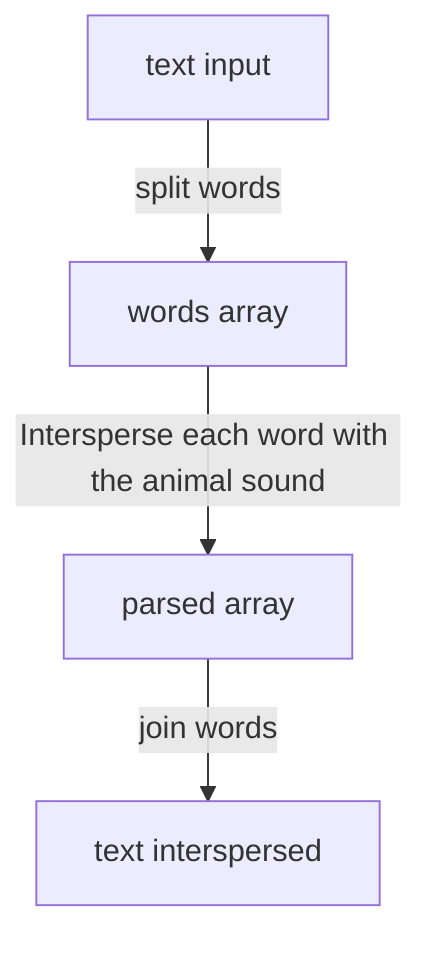

This exercise aims to implement a mechanism that allows different animals to speak with each other. 
In order to reuse the logic for all different kinds of breeds, we could have a parent class as shown in the diagram.



Each breed specifies its sound when inheriting from an Animal. That way, speak method will be aware of which sound to intersperse.
The speak method follows the next logic.


Example:
```js
    const lion = new Lion();
    lion.speak(`I'm a lion`);
    // I'm roar a roar lion roar
```
